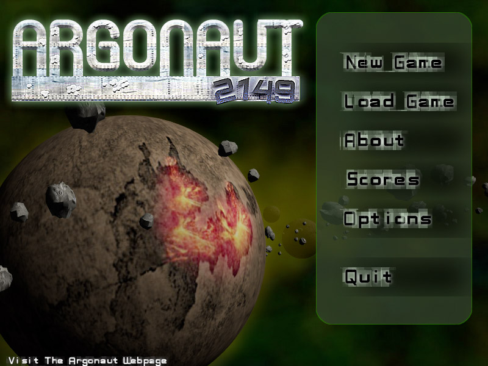
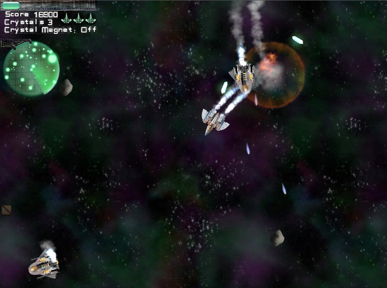

**Important**: Argonaut 2149 is open-source software but its **license disallows commercial use**. See License.txt.

Argonaut 2149 is a game where you can join the lucrative trade of crystal mining! Navigate through deadly asteroid fields, do battle with menacing pirates and greedy scavengers, and gather wealth for the purchase of powerful weapons and power-ups in this arcade style asteroids game.

The game was first published in 2003 and won "Best Overall Game" in the uDevGames competition. It was last updated in 2007 and version 1.2.1 was made available as a Universal application for both PowerPC and x86 based Macs running Mac OS X 10.4 and later.

People using current versions of XCode should use the `master` branch. If you have a very old Mac and very old development tools you can try your luck with the `legacy` branch. It may or may not work.

Many aspect's of Argonaut 2149's source code are quite old and therefore outdated. The game was written mainly in  Objective-C 1.0 that (necessarily at the time) used pre-ARC manual retain/release style memory management and did not have access to modern language features like `instancetype`, properties, `NS_ENUM`, `NS_OPTIONS`, designated initializers, generics, nullability specifiers, etc. In addition you'll find other questionable design choices that are not excused by its age.

Argonaut 2149 features old school fixed-function OpenGL graphics that is not part of the modern OpenGL Core. Although they are far from modern best practices these compatiibility profile graphics stlil work (as of this writing) on the latest version of MacOS (10.13).

